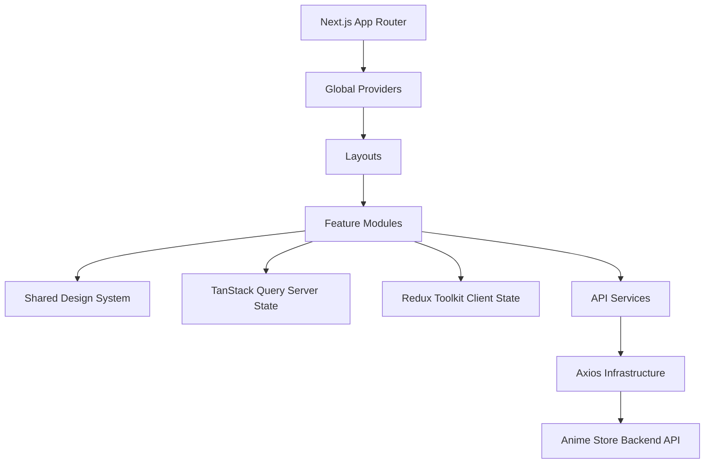
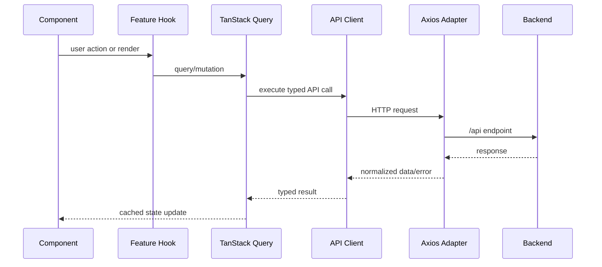
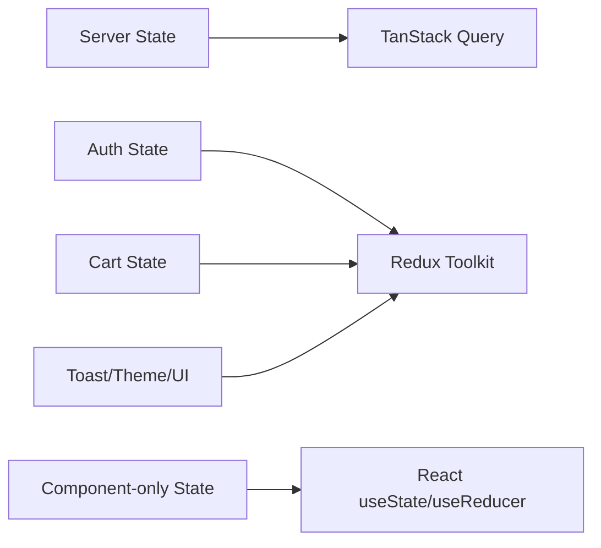
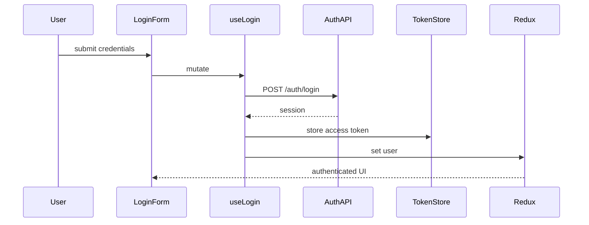
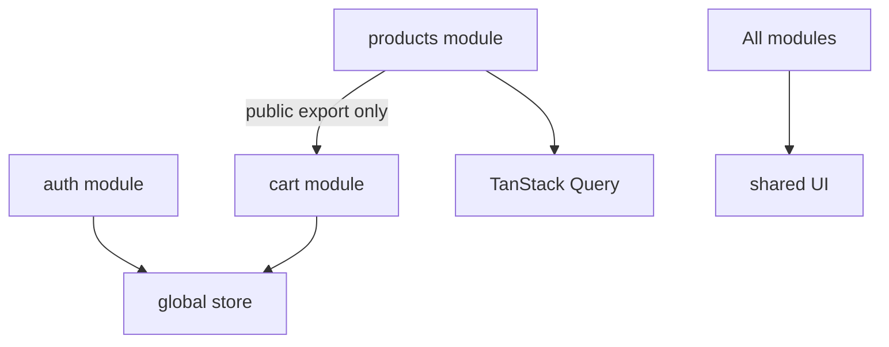
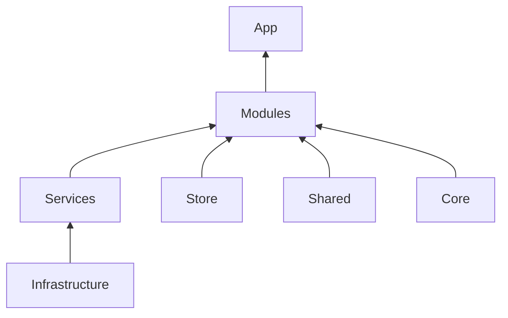

# Frontend Architecture

The frontend uses Feature-Driven Modular Architecture with Clean Architecture concepts adapted for React and Next.js.

## Application Architecture

## Request Lifecycle

## State Management Flow

## Authentication Flow

## Feature Communication

## Dependency Direction

