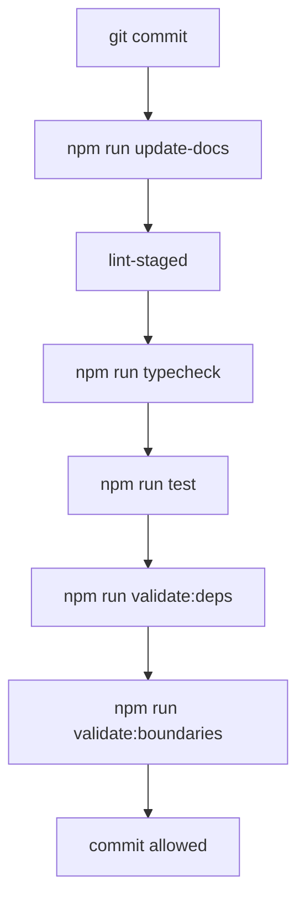

# Quality System

## Pre-Commit Pipeline

## Checks
- ESLint detects unsafe code and architectural import mistakes.
- Prettier keeps formatting consistent.
- TypeScript blocks type regressions.
- Jest validates components and feature services.
- Madge detects circular dependencies.
- Boundary script prevents private cross-feature imports.
