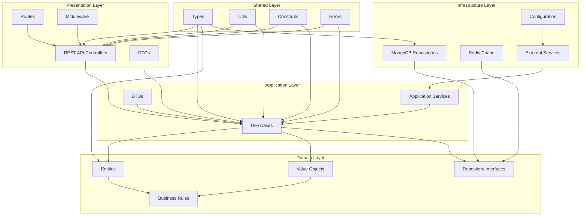
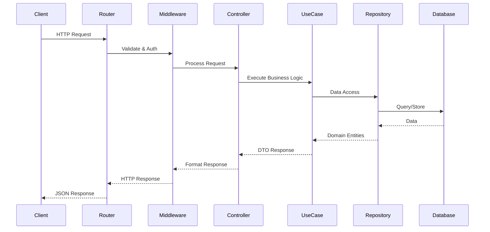
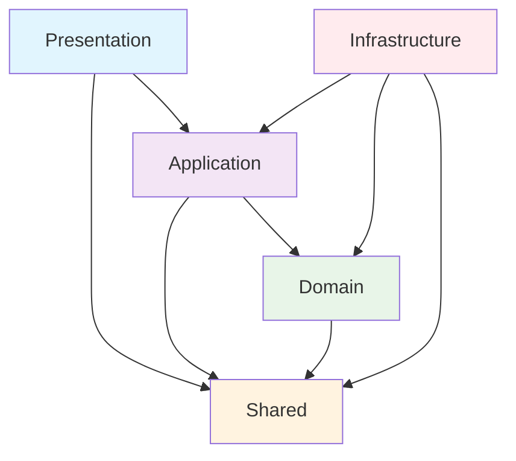
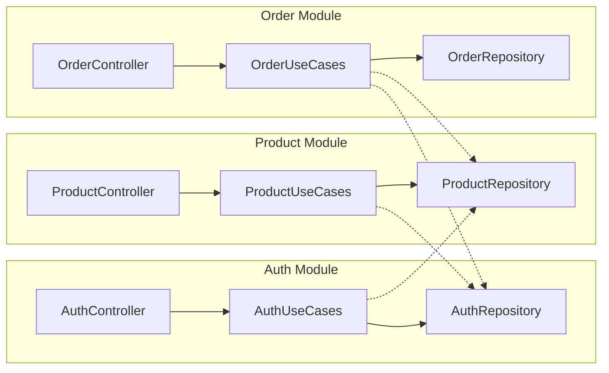

# Architecture Documentation

## Clean Architecture Overview

## Request Lifecycle

## Dependency Flow

## Module Communication

## Clean Architecture Boundary Explanation

### Dependency Direction
- **Outer layers** depend on **inner layers**
- **Inner layers** have no knowledge of **outer layers**
- Dependencies point **inward** toward the domain

### Layer Boundaries
1. **Presentation** → Application → Domain ← Infrastructure
2. **Infrastructure** implements interfaces defined in **Domain**
3. **Application** orchestrates **Domain** entities
4. **Presentation** adapts **Application** for delivery

### Benefits
- **Testability**: Inner layers can be tested in isolation
- **Maintainability**: Changes in outer layers don't affect inner layers
- **Flexibility**: Can swap implementations without changing business logic
- **Framework Independence**: Domain is free from external dependencies