# Anime Store Backend Architecture Flow Diagram

```mermaid
%% Anime Store Backend Architecture Flow Diagram
%% Generated: May 10, 2026
%% This diagram shows the complete flow of the Clean Architecture implementation

graph TB
    %% External Actors
    subgraph "External Systems"
        Client[👤 Client<br/>Web/Mobile App]
        Admin[👨‍💼 Admin User]
        DB[(📊 MongoDB<br/>Database)]
        Redis[(🔴 Redis<br/>Cache)]
        Email[📧 Email Service]
        Payment[💳 Payment Gateway]
    end

    %% Presentation Layer
    subgraph "Presentation Layer 🌐"
        subgraph "API Gateway"
            Routes[🛣️ Routes<br/>/api/*]
            Middleware[🔒 Middleware<br/>Auth, Validation, CORS]
        end

        subgraph "Controllers"
            AuthCtrl[🔐 AuthController<br/>register, login]
            ProductCtrl[📦 ProductController<br/>CRUD operations]
            OrderCtrl[🛒 OrderController<br/>create, get orders]
        end

        subgraph "Validation & Security"
            JoiVal[✅ Joi Validation<br/>Request schemas]
            AuthMW[🔑 JWT Auth<br/>verify tokens]
            RoleMW[👮 Role-based<br/>admin/customer]
            ErrorHandler[🚨 Global Error<br/>Handler]
        end
    end

    %% Application Layer
    subgraph "Application Layer 🎯"
        subgraph "Use Cases"
            RegisterUC[📝 RegisterUser<br/>UseCase]
            LoginUC[🔓 LoginUser<br/>UseCase]
            CreateProductUC[➕ CreateProduct<br/>UseCase]
            CreateOrderUC[🛍️ CreateOrder<br/>UseCase]
        end

        subgraph "DTOs"
            AuthDTO[🔐 Auth DTOs<br/>Register, Login, Response]
            ProductDTO[📦 Product DTOs<br/>Create, Update, Response]
            OrderDTO[🛒 Order DTOs<br/>Create, Response]
        end

        subgraph "Services"
            AuthSvc[🔐 IAuthService<br/>JWT, Password Hashing]
        end
    end

    %% Domain Layer
    subgraph "Domain Layer 🧠"
        subgraph "Entities"
            UserEntity[👤 User<br/>id, email, role]
            ProductEntity[📦 Product<br/>name, price, stock]
            OrderEntity[🛒 Order<br/>items, status, total]
            CartEntity[🛒 Cart<br/>user, items, total]
            CategoryEntity[📂 Category<br/>name, description]
            AnimeEntity[🎬 Anime<br/>title, genre, rating]
            PaymentEntity[💳 Payment<br/>amount, status]
            ReviewEntity[⭐ Review<br/>rating, comment]
            WishlistEntity[❤️ Wishlist<br/>user, products]
        end

        subgraph "Value Objects"
            EmailVO[📧 Email<br/>validation]
            PasswordVO[🔒 Password<br/>hashing]
        end

        subgraph "Repository Interfaces"
            IUserRepo[👤 IUserRepository<br/>findById, create, update]
            IProductRepo[📦 IProductRepository<br/>findById, search, create]
            ICartRepo[🛒 ICartRepository<br/>findByUserId, update]
            IOrderRepo[🛒 IOrderRepository<br/>create, findByUserId]
        end

        subgraph "Business Rules"
            UserRules[👤 User Rules<br/>email unique, password strength]
            ProductRules[📦 Product Rules<br/>stock validation, price > 0]
            OrderRules[🛒 Order Rules<br/>stock availability, total calc]
        end
    end

    %% Infrastructure Layer
    subgraph "Infrastructure Layer 🔌"
        subgraph "Database Layer"
            UserModel[👤 UserModel<br/>Mongoose Schema]
            ProductModel[📦 ProductModel<br/>Mongoose Schema]
            OrderModel[🛒 OrderModel<br/>Mongoose Schema]
            CartModel[🛒 CartModel<br/>Mongoose Schema]
            DBConn[🔌 DatabaseConnection<br/>MongoDB client]
        end

        subgraph "Repository Implementations"
            UserRepoImpl[👤 UserRepositoryImpl<br/>MongoDB operations]
            ProductRepoImpl[📦 ProductRepositoryImpl<br/>MongoDB operations]
            CartRepoImpl[🛒 CartRepositoryImpl<br/>MongoDB operations]
            OrderRepoImpl[🛒 OrderRepositoryImpl<br/>MongoDB operations]
        end

        subgraph "External Services"
            AuthSvcImpl[🔐 AuthServiceImpl<br/>JWT, bcrypt]
            RedisSvc[🔴 Redis Service<br/>caching, sessions]
            EmailSvc[📧 Email Service<br/>notifications]
            PaymentSvc[💳 Payment Service<br/>Stripe/PayPal]
        end

        subgraph "Configuration"
            Config[⚙️ Config<br/>environment variables]
            Logger[📝 Winston Logger<br/>structured logging]
        end
    end

    %% Shared Layer
    subgraph "Shared Layer 🛠️"
        subgraph "Core Utilities"
            Container[📦 Inversify Container<br/>DI bindings]
            Helpers[🛠️ Helpers<br/>pagination, response]
            Constants[📋 Constants<br/>HTTP codes, messages]
        end

        subgraph "Types & Interfaces"
            CommonTypes[🔧 Common Types<br/>Pagination, ApiResponse]
            CustomErrors[🚨 Custom Errors<br/>ValidationError, NotFoundError]
        end
    end

    %% Flow Connections
    Client --> Routes
    Admin --> Routes

    Routes --> Middleware
    Middleware --> AuthCtrl
    Middleware --> ProductCtrl
    Middleware --> OrderCtrl

    AuthCtrl --> RegisterUC
    AuthCtrl --> LoginUC
    ProductCtrl --> CreateProductUC
    OrderCtrl --> CreateOrderUC

    RegisterUC --> AuthSvc
    LoginUC --> AuthSvc
    CreateProductUC --> IProductRepo
    CreateOrderUC --> ICartRepo
    CreateOrderUC --> IOrderRepo
    CreateOrderUC --> IProductRepo

    AuthSvc --> AuthSvcImpl
    IProductRepo --> ProductRepoImpl
    ICartRepo --> CartRepoImpl
    IOrderRepo --> OrderRepoImpl

    ProductRepoImpl --> ProductModel
    UserRepoImpl --> UserModel
    CartRepoImpl --> CartModel
    OrderRepoImpl --> OrderModel

    ProductModel --> DB
    UserModel --> DB
    CartModel --> DB
    OrderModel --> DB

    AuthSvcImpl --> Redis
    RedisSvc --> Redis

    EmailSvc --> Email
    PaymentSvc --> Payment

    %% Business Rules Flow
    UserEntity -.-> UserRules
    ProductEntity -.-> ProductRules
    OrderEntity -.-> OrderRules

    %% Dependency Injection
    Container -.-> RegisterUC
    Container -.-> LoginUC
    Container -.-> CreateProductUC
    Container -.-> CreateOrderUC
    Container -.-> AuthCtrl
    Container -.-> ProductCtrl
    Container -.-> OrderCtrl

    %% Styling
    classDef presentation fill:#e1f5fe,stroke:#01579b,stroke-width:2px
    classDef application fill:#f3e5f5,stroke:#4a148c,stroke-width:2px
    classDef domain fill:#e8f5e8,stroke:#1b5e20,stroke-width:2px
    classDef infrastructure fill:#ffebee,stroke:#b71c1c,stroke-width:2px
    classDef shared fill:#fff3e0,stroke:#e65100,stroke-width:2px
    classDef external fill:#f5f5f5,stroke:#424242,stroke-width:2px

    class Routes,Middleware,AuthCtrl,ProductCtrl,OrderCtrl,JoiVal,AuthMW,RoleMW,ErrorHandler presentation
    class RegisterUC,LoginUC,CreateProductUC,CreateOrderUC,AuthDTO,ProductDTO,OrderDTO,AuthSvc application
    class UserEntity,ProductEntity,OrderEntity,CartEntity,CategoryEntity,AnimeEntity,PaymentEntity,ReviewEntity,WishlistEntity,EmailVO,PasswordVO,IUserRepo,IProductRepo,ICartRepo,IOrderRepo,UserRules,ProductRules,OrderRules domain
    class UserModel,ProductModel,OrderModel,CartModel,DBConn,UserRepoImpl,ProductRepoImpl,CartRepoImpl,OrderRepoImpl,AuthSvcImpl,RedisSvc,EmailSvc,PaymentSvc,Config,Logger infrastructure
    class Container,Helpers,Constants,CommonTypes,CustomErrors shared
    class Client,Admin,DB,Redis,Email,Payment external
```



## Data Flow Explanation

### 1. **Request Flow**
```
Client → Routes → Middleware → Controller → Use Case → Repository → Database
```

### 2. **Authentication Flow**
```
Login Request → AuthController → LoginUseCase → IAuthService → AuthServiceImpl → JWT Token
```

### 3. **Order Creation Flow**
```
Create Order → OrderController → CreateOrderUseCase → Validate Stock → Update Inventory → Create Order
```

### 4. **Dependency Injection Flow**
```
Container → Bind Interfaces → Resolve Dependencies → Inject into Classes
```

## Key Components Legend

| Symbol | Component Type | Description |
|--------|----------------|-------------|
| 👤 | User-related | Authentication, profiles |
| 📦 | Product-related | Items, inventory, categories |
| 🛒 | Order/Cart | Shopping, checkout, orders |
| 🔐 | Security | Auth, JWT, validation |
| 🧠 | Domain | Business logic, entities |
| 🎯 | Application | Use cases, workflows |
| 🌐 | Presentation | API, controllers |
| 🔌 | Infrastructure | Database, external services |
| 🛠️ | Shared | Utilities, constants |

## Architecture Principles Illustrated

1. **Dependency Direction**: Outer layers depend on inner layers
2. **Clean Boundaries**: Each layer has specific responsibilities
3. **Dependency Injection**: Loose coupling through interfaces
4. **SOLID Principles**: Single responsibility, open/closed, etc.
5. **Testability**: Each layer can be tested independently

## Update Instructions for AI

When the codebase is modified:

1. **Adding New Entity**: Add to Domain Entities section
2. **New Use Case**: Add to Application Use Cases section
3. **New Repository**: Add to Repository Interfaces and Implementations
4. **New API Endpoint**: Add to Controllers and Routes
5. **New External Service**: Add to External Services section

**Run the update script**: `node scripts/update-diagram.js` to regenerate this diagram automatically.