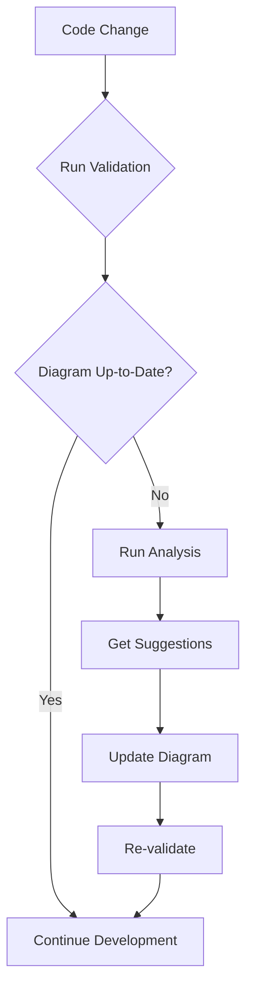

# Architecture Flow Diagram System

## Overview

This system provides a comprehensive visual representation of the Anime Store backend architecture using Mermaid diagrams, along with automated tools for maintaining the diagrams as the codebase evolves.

## Files Created

### 1. `ARCHITECTURE_FLOW.md`
A detailed Mermaid diagram showing:
- Complete system architecture
- Data flow between layers
- Component relationships
- External system integrations
- Business logic flow

### 2. `scripts/update-diagram.js`
An automated script that:
- Analyzes the TypeScript codebase
- Extracts classes, interfaces, and components
- Validates diagram accuracy
- Generates update suggestions
- Provides maintenance guidance

### 3. `scripts/README.md`
Documentation for using the diagram maintenance system.

## How to Use

### For Humans 👥

1. **Read the Architecture**: Open `ARCHITECTURE_FLOW.md` to understand the system
2. **Follow Data Flow**: Use the diagram to trace how requests flow through the system
3. **Understand Dependencies**: See how components relate to each other

### For AI Agents 🤖

1. **Before Code Changes**: Run `npm run validate-diagram` to check current state
2. **After Adding Components**: Run `npm run update-diagram suggest` for guidance
3. **Update Documentation**: Use suggestions to update `ARCHITECTURE_FLOW.md`

## Maintenance Workflow



## Key Features

### Visual Architecture Understanding
- **Layer Separation**: Clear boundaries between Domain, Application, Infrastructure, Presentation
- **Data Flow**: Arrows showing how data moves through the system
- **Component Types**: Icons and labels for different component types
- **External Systems**: Database, cache, email, payment integrations

### Automated Maintenance
- **Code Analysis**: Automatically scans TypeScript files
- **Component Detection**: Identifies classes, interfaces, and exports
- **Validation**: Checks if diagram matches actual code
- **Suggestions**: Provides specific update recommendations

### AI-Friendly Updates
- **Structured Output**: Clear, actionable suggestions
- **Component Mapping**: Direct correlation between code and diagram
- **Validation Reports**: Percentage completion metrics

## Example Usage Scenarios

### Adding a New Feature
```bash
# 1. Add new entity, use case, controller
# 2. Run validation
npm run validate-diagram

# 3. Get suggestions for diagram updates
npm run update-diagram suggest

# 4. Update ARCHITECTURE_FLOW.md with new components
# 5. Re-validate
npm run validate-diagram
```

### Code Review
```bash
# Check if architecture documentation is current
npm run validate-diagram

# Get overview of all components
npm run analyze-codebase
```

### Onboarding New Developers
```bash
# Show them the architecture diagram
# Explain using the visual flow
# Use analysis to demonstrate component relationships
```

## Benefits

### For Human Developers
- **Quick Understanding**: Visual representation of complex architecture
- **Onboarding Aid**: New developers can understand the system quickly
- **Documentation**: Self-documenting architecture

### For AI Agents
- **Automated Updates**: Script provides guidance for documentation updates
- **Validation**: Ensures documentation stays accurate
- **Structured Information**: Clear component relationships and dependencies

### For the Project
- **Maintainability**: Architecture documentation stays current
- **Consistency**: Standardized way to document changes
- **Quality Assurance**: Automated checks prevent documentation drift

## Future Enhancements

The system can be extended to:
- **Auto-update diagrams** when code changes
- **Generate multiple formats** (PlantUML, Draw.io, SVG)
- **API documentation integration** with Swagger
- **Dependency graphs** showing import relationships
- **Performance metrics** integration
- **CI/CD integration** for automated validation

## Commands Summary

```bash
# Analyze codebase structure
npm run analyze-codebase

# Get diagram update suggestions
npm run update-diagram suggest

# Validate diagram accuracy
npm run validate-diagram

# Generate update content
npm run update-diagram update
```

This system ensures that both humans and AI agents can easily understand and maintain the Anime Store backend architecture as it evolves.